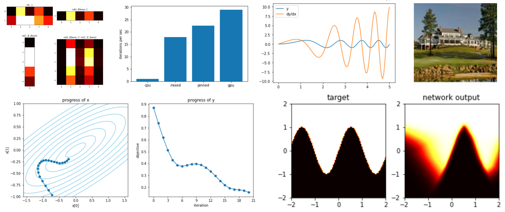

David's Tips on How to Read Pytorch
===================================

These five python notebooks are an introduction to core pytorch idioms.

  1. [Tensor arithmetic](https://colab.research.google.com/github/davidbau/how-to-read-pytorch/blob/master/notebooks/1-Pytorch-Introduction.ipynb): the notation for manipulating n-dimensional arrays of numbers on CPU or GPU.
  2. [Autograd](https://colab.research.google.com/github/davidbau/how-to-read-pytorch/blob/master/notebooks//2-Pytorch-Autograd.ipynb): how to get derivatives of any scalar with respect to any tensor input.
  3. [Optimization](https://colab.research.google.com/github/davidbau/how-to-read-pytorch/blob/master/notebooks//3-Pytorch-Optimizers.ipynb): ways to update tensor parameters to reduce any computed objective, using autograd gradients.
  4. [Network modules](https://colab.research.google.com/github/davidbau/how-to-read-pytorch/blob/master/notebooks//4-Pytorch-Modules.ipynb): how pytorch represents neural networks for convenient composition, training, and saving.
  5. [Datasets and Dataloaders](https://colab.research.google.com/github/davidbau/how-to-read-pytorch/blob/master/notebooks//5-Pytorch-Dataloader.ipynb): for efficient multithreaded prefetching of large streams of data.

Pytorch is a numerical library that makes it very convenient to train deep networks on GPU hardware. It introduces a new programming vocabulary that takes a few steps beyond regular numerical python code. Although pytorch code can look simple and concrete, much of of the subtlety of what happens is invisible, so when working with pytorch code it helps to thoroughly understand the runtime model.

For example, consider this code:

```
torch.nn.cross_entropy(model(images.cuda()), labels.cuda()).backward()
optimizer.step()
```

It looks like it computes some function of `images` and `labels` without storing the answer.  But actually the purpose of this code is to update some hidden parameters that are not explicit in this formula.  This line of code moves batches of image and label data from CPU to the GPU; runs a neural network to make a prediction; constructs a computation graph describing how the loss depends on the network parameters; annotates every network parameter with a gradient; then finally it runs one step of optimization to adjust every parameter of the model.  During all this, the CPU does not see any of the actual answers.  That is intentional for speed reasons.  All the numerical computation is done on the GPU asynchronously and kept there.

The berevity of the code is what makes pytorch code fun to write.  But it also reflects why pytorch can be so fast even though the python interpreter is so slow. Although the main python logic slogs along sequentially in a single very slow CPU thread, just a few python instructions can load a huge amount of work into the GPU.  That means the program can keep the GPU busy churning through massive numerical computations, for most part, without waiting for the python interpreter.

Is is worth understanding the follwoing idioms that work together to make this possible. The five notebooks in this directory are a quick overview of these idioms.

The key ideas are illustrated with small, runnable, tweakable examples, and there are links to other reference material and resources.

All the notebooks can be run on Google Colab where some GPU compuation can be used for free, or they can be run on your own local Jupyter notebook server.

The examples should all work with python 3.5 or newer and pytorch 1.0 or newer.

--- *David Bau, July 2020*


